## 基于Java+Springboot的健身房管理系统089

## 一、系统介绍

本系统分为管理员、用户两种角色

用户角色包含以下功能：

- 登录、报名课程、我的报名、个人中心修改

管理员角色包含以下功能：

- 登录、首页统计、会员卡查询、会员管理、员工管理、器材管理、课程管理、个人信息修改

## 2.系统结构图
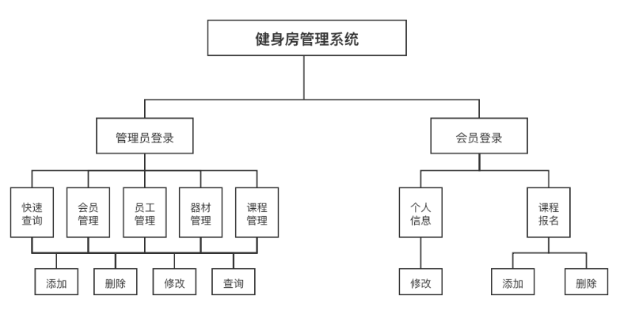

## 二、所用技术

后端技术栈：

- Springboot
- Mybatis
- Mysql

前端技术栈：

- Thymeleaf
- html

## 三、环境介绍

基础环境 :IDEA/eclipse, JDK1.8, Mysql5.7及以上, Maven3.6

所有项目以及源代码本人均调试运行无问题 可支持远程调试运行

## 四、页面截图

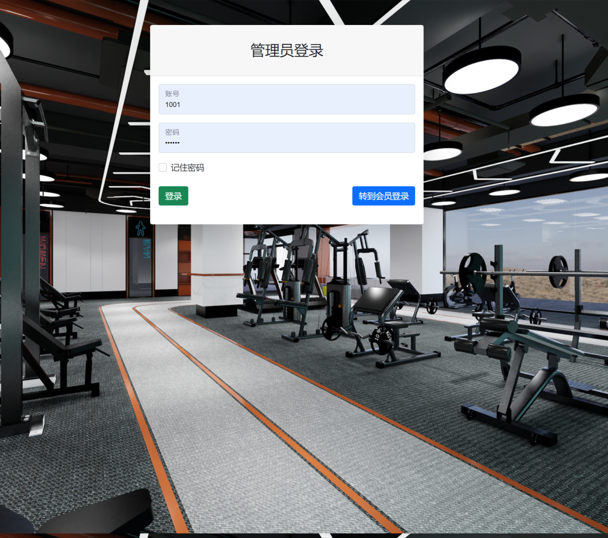
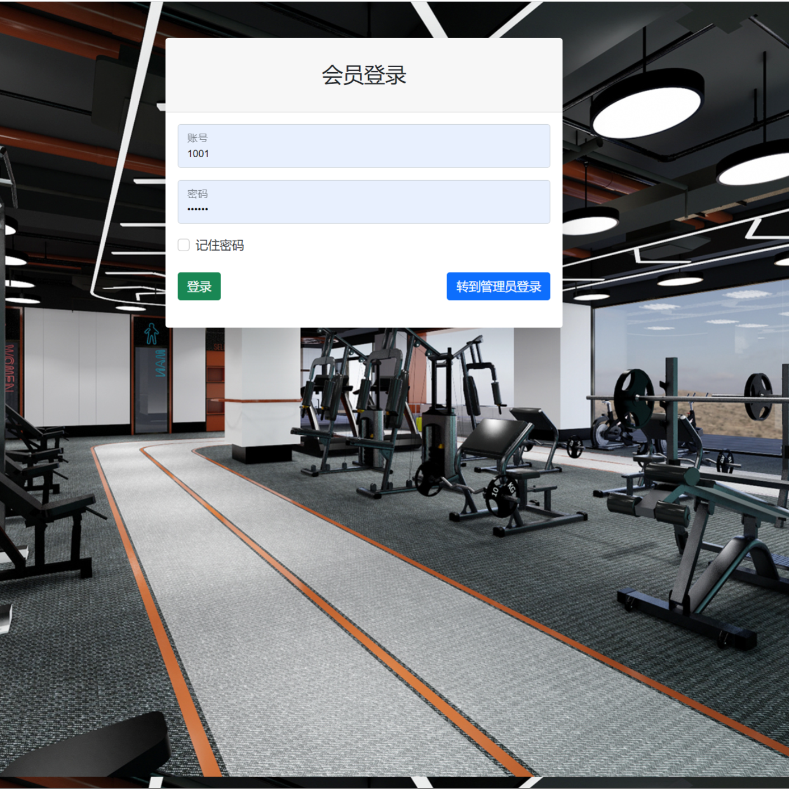
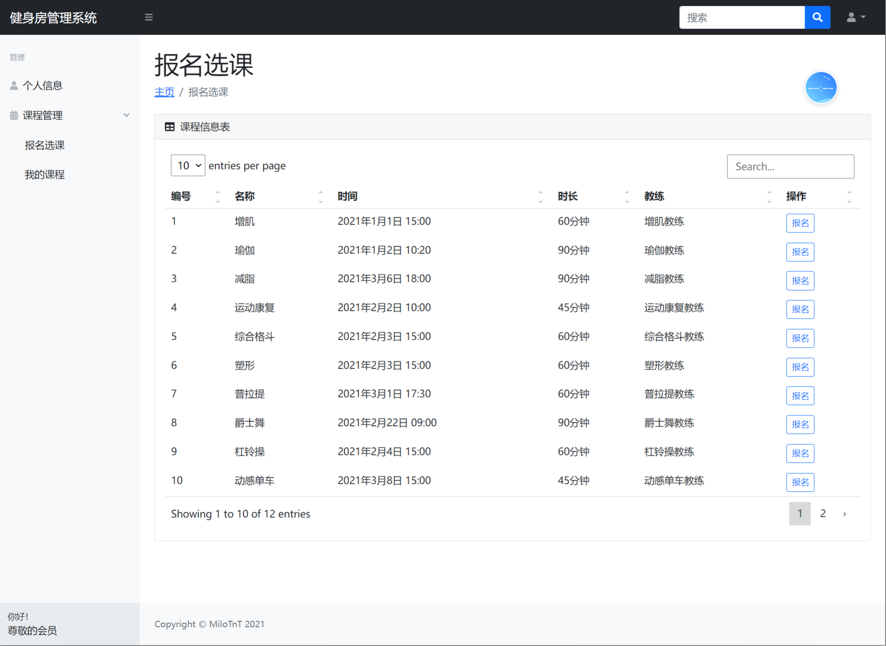
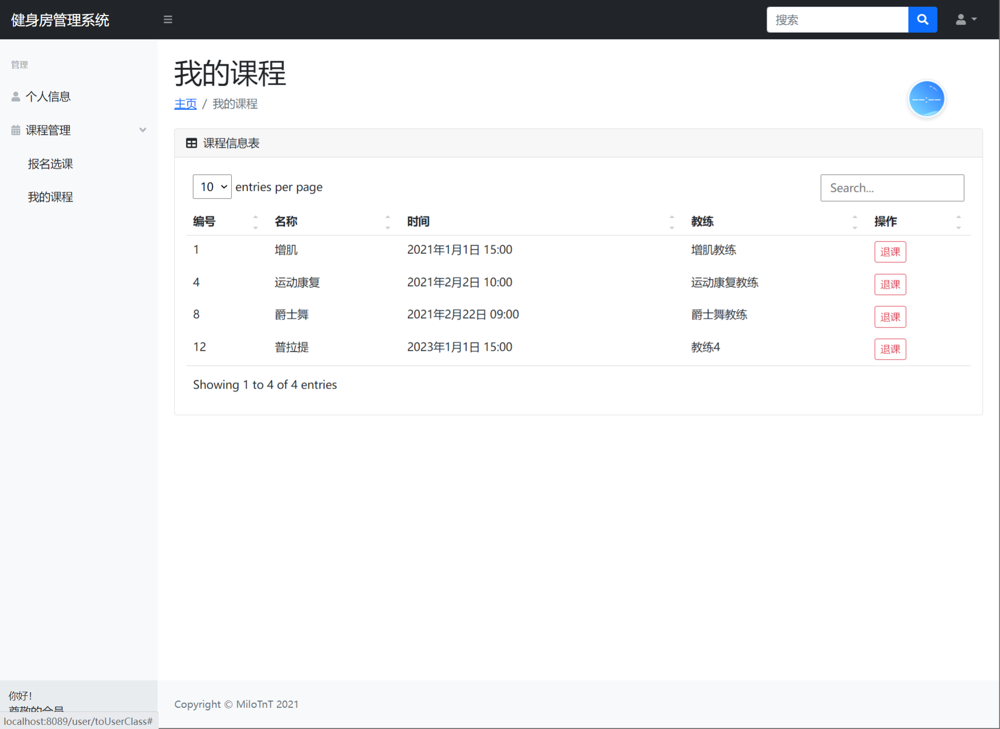
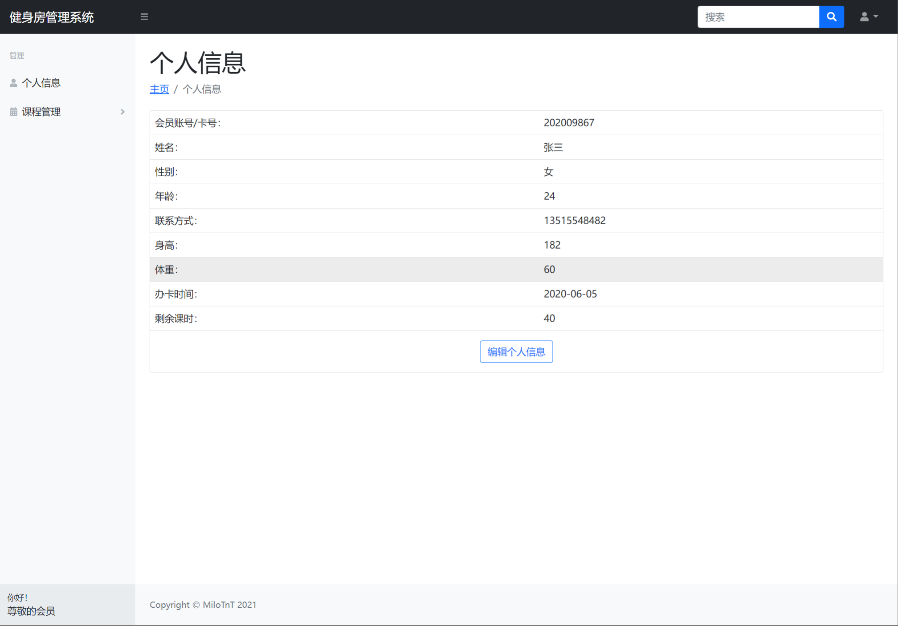
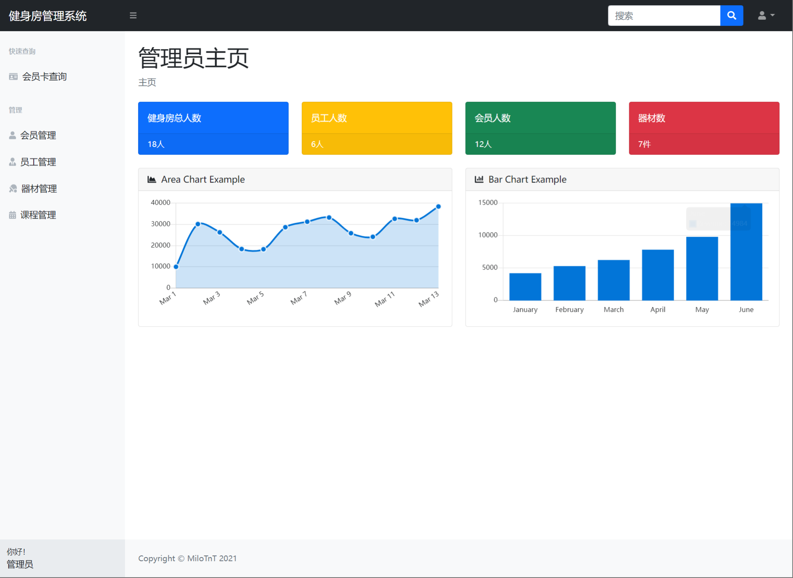
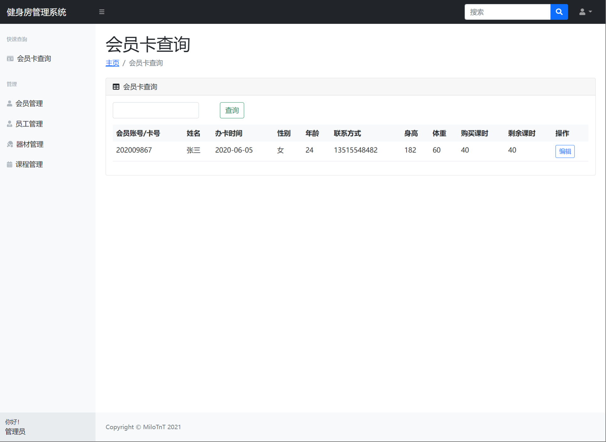
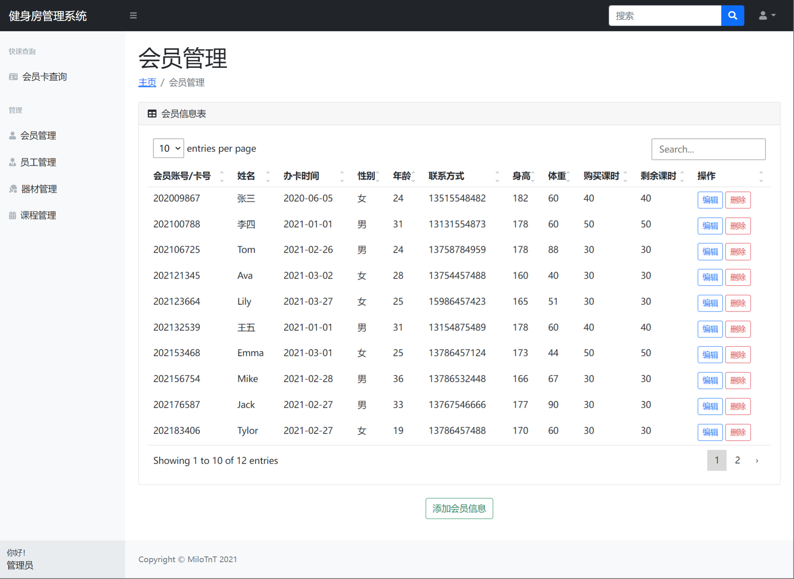
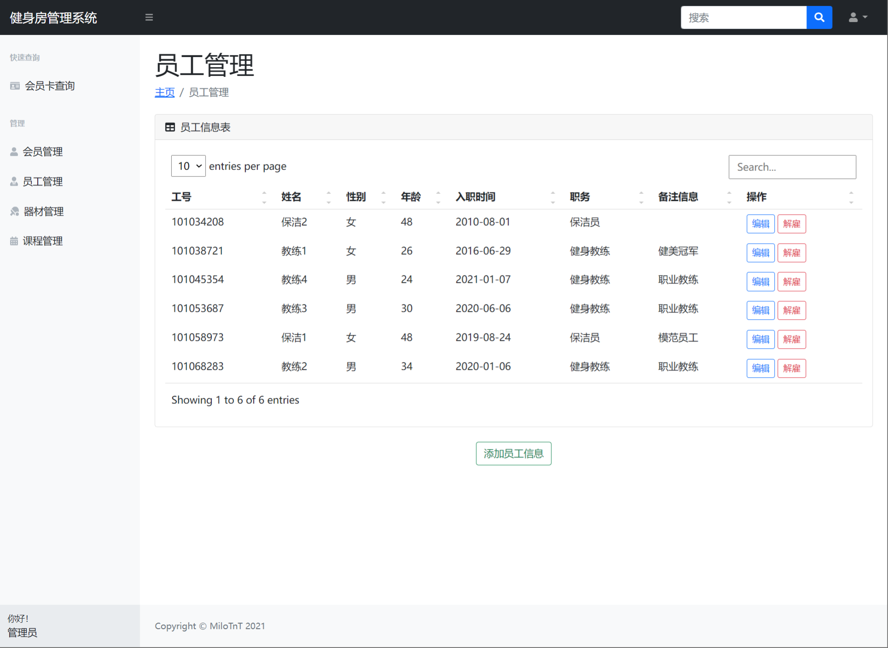
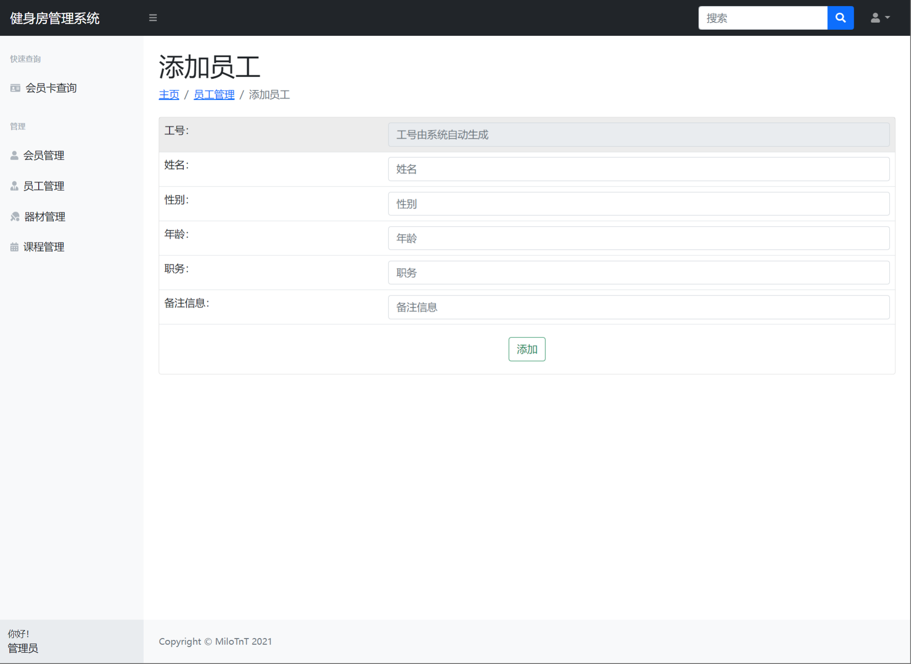
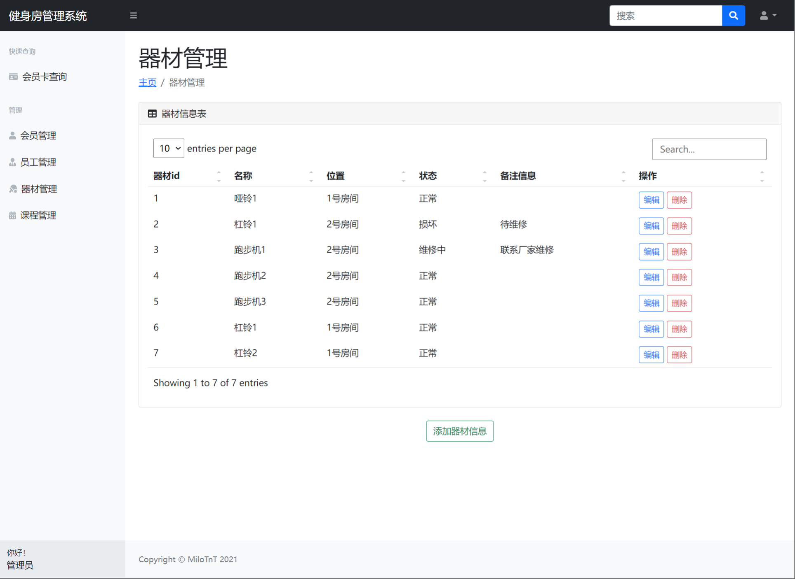

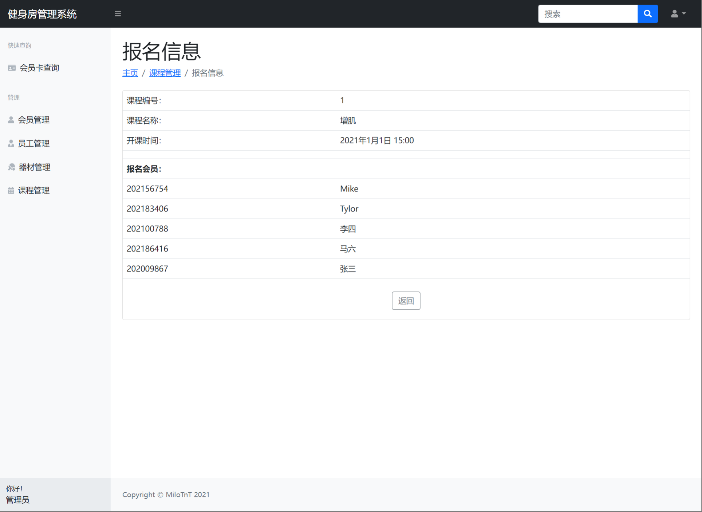
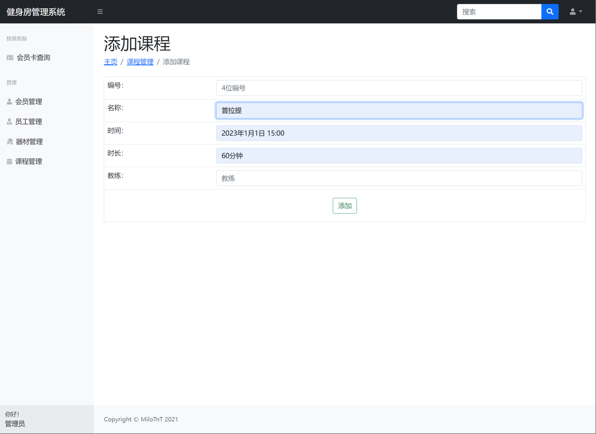

## 五、浏览地址
访问地址：http://localhost:8089

- 用户账号/密码：202009867/123456
- 管理员账号/密码：1001/123456

## 六、部署教程

1. 使用Navicat或者其它工具，在mysql中创建对应名称的数据库，并执行项目的sql文件；

2. 使用IDEA/Eclipse导入项目，若为maven项目请选择maven，等待依赖下载完成；

3. 修改application.yml 里面的数据库配置

4. src/main/java/com/milotnt/GymManagementSystemApplication.java 启动项目

